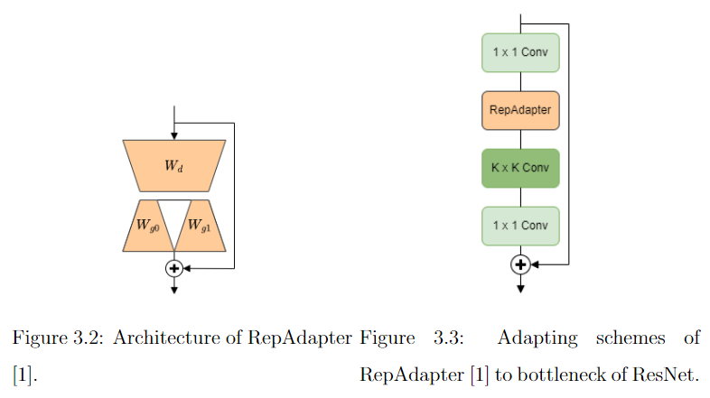
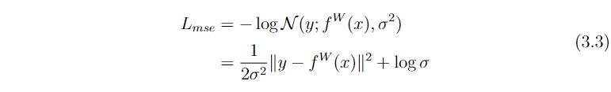
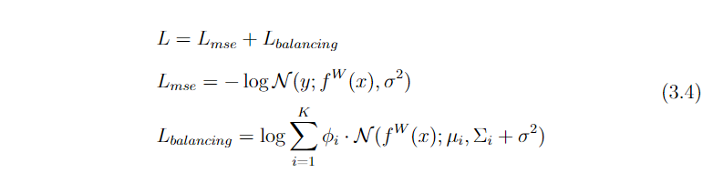

# Openpilot_BalancedRegression_Adapter

## Introduction

This repository allows training custom driving models for [Openpilot](https://github.com/commaai/openpilot) using datasets collected from [Roach](https://github.com/zhejz/carla-roach) and [Comma2k19](https://github.com/commaai/comma2k19).

we leverage the adapter architecture to fine-tune the Supercombo model using datasets collected from a reinforcement learning agent in the CARLA simulator. This approach allows us to preserve the original weights in Openpilot, which have been trained on a large-scale dataset using significant computing resources. The adapter architecture enables efficient adaptation of pretrained models for downstream tasks. Our approach not only includes path prediction and lead car prediction but also incorporates lane lines detection.

* [Directory Structure](#directory-structure) 
* [Quick Preview](#quick-preview)
    * [Adapter](#adapter)
    * [Multi-Task Learning](#multi-task-learning)
    * [Balanced Regression](#balanced-regression)
    * [Phase training](#phase-training)
* [Data Collection](#data-collection)
* [Installations](#installations)
* [Training](#training)
* [Evaluation](#evaluation)
    * [AP](#ap)
    * [Visualization](#visualization)
* [Using the Model](#using-the-model)  

***
## Directory Structure

```
Openpilot_finetune
├── Openpilot_lateralMPC   - For changing lateralMPC of Openpilot in docker.
├── common                 - Library like functionality from Openpilot.  Ex. Coordinate transformation
├── train                  - Main training code.
```

## Quick Preview
### Adapter
[Repadapter](https://github.com/luogen1996/RepAdapter) is a parameter-efficient and computationally friendly adapter for giant vision models, which can be seamlessly integrated into most vision models via structural re-parameterization. RepAdapter is introduced prior to the k x k convolutional layer in the bottleneck.




### Multi-Task Learning
Inspired by the principles of multi-task learning delineated in [the paper](https://arxiv.org/abs/1705.07115), we employ the concept of homoscedastic uncertainty associated with each distinct task to create a balanced weighting of multiple loss functions.



The implemented loss is L1 loss instead of L2 loss, and more in line with network training. [More](https://github.com/yaringal/multi-task-learning-example/issues/4#issuecomment-547286656)
```python
def path_laplacian_nll_loss(mean_true, mean_pred, sigma, sigma_clamp: float = 1e-3, loss_clamp: float = 1000.):
    err = torch.abs(mean_true - mean_pred)
    sigma = torch.clamp(sigma, min=sigma_clamp) # lower bound
    #sigma = torch.max(sigma, torch.log(1e-6 + err/loss_clamp))
    nll = err * torch.exp(-sigma) + sigma
    return nll.sum(dim=(1,2))
```
For classification tasks in multi-task learning, using the same method in `train/AutomaticWeightedLoss.py`
### Balanced Regression
The prediction of the distance between the lead vehicle and the ego car by Supercombo falls under the category of visual regression, wherein models are trained to predict continuous labels. 
[Balanced MSE](https://github.com/jiawei-ren/BalancedMSE/tree/main) is a reevaluation of the Mean Squared Error (MSE) loss function from a statistical perspective, proposing a novel loss function to address the issue of imbalanced regression problems. Balanced MSE tackles the  imbalance in the distribution of training labels by incorporating a balancing term, thus bridging the distribution gap between training and testing. 


The implemented loss is L1 loss instead of L2 loss.
```python
class GAILoss(torch.nn.Module):
    def __init__(self, gmm):
        super(GAILoss, self).__init__()
        self.gmm = joblib.load(gmm)
        self.gmm = {k: torch.tensor(self.gmm[k]).cuda() for k in self.gmm}

    def forward(self, pred, target, noise_scale):
        loss = gai_loss(pred, target, self.gmm, noise_scale)
        return loss

def gai_loss(pred, target, gmm, noise_scale):
    gmm = {k: gmm[k].reshape(1, -1).expand(pred.shape[0], -1) for k in gmm}
    noise_scale =  torch.clamp(noise_scale, min=1e-3) # lower bound
    mse_term = F.l1_loss(pred, target, reduction='none') / noise_scale + noise_scale.log()
    sum_scale = (gmm['variances'] / 2).sqrt() + noise_scale
    balancing_term = - sum_scale.log() - abs(pred - gmm['means']) / sum_scale + gmm['weights'].log()
    balancing_term = torch.logsumexp(balancing_term, dim=-1, keepdim=True)
    loss = mse_term + balancing_term
    loss = loss * noise_scale.detach()

    return loss.squeeze()
```
### Phase training
The fine-tuning procedure for the Supercombo model involves the following phases:

* First phase: Utilize Carla-Roach datasets to fine-tune Supercombo model for leading car prediction and path prediction.
* Second phase: Further fine-tune the model from First phase using Comma2k19 datasets to enhance lane lines detection.
* Third phase: Fine-tune the model from Second phase using Carla-Roach datasets to integrate leading car prediction, path prediction, and lane lines detection

## Data Collection
The dataset [Roach](https://github.com/zhejz/carla-roach) collected initially don't include all the necessary information for training ”plan”, ”leads” predictions and "lane lines" detection. Therefore, we modified the code to allow for proper data collection.

`Modify_Roach/rgb.py` collect camera position, camera rotation, and lead car information.

`Modify_Roach/speed.py` collect car speed, accel.

`Modify_Roach/lane_markings.py` and `Modify_Roach/config_lane_markings.py` collect lane lines information.

1. Replace following files 

 * Path of `rgb.py` in Roach : `carla-roach/carla_gym/core/obs_manager/camera/rgb.py`
  
 * Path of `speed.py` in Roach : `carla-roach/carla_gym/core/obs_manager/actor_state/speed.py`

2. Add following files

 * `lane_markings.py` and `config_lane_markings.py` in Roach : `carla-roach/carla_gym/core/obs_manager/camera`
  
3. Modify framerate to 20 (Supercombo takes two consecutive frames with a framerate of 20 as input)

* Modify `carla-roach/carla_gym/carla_multi_agent_env.py` line [173](https://github.com/zhejz/carla-roach/blob/main/carla_gym/carla_multi_agent_env.py#L173C43-L173C43)
  ```
        settings.fixed_delta_seconds = 0.05
  ```
4. Modify the resolution settings, FOV settings and camera position

   * Modify `carla-roach/config/agent/cilrs/obs_configs/central_rgb_wide.yaml`
  ```
  fov: 40
  width: 1440
  height: 960
  location: [0.8, 0.0, 1.13]
  rotation: [0.0, 0.0, 0.0]
  ```
5. Collect dataset with Roach
* ex. Collect `n_episodes=240` with `cc_data` environment
## Installations
1. Clone the repo
```bash
git clone https://github.com/Jackie890621/Openpilot_finetune.git
```

2. Install [conda](https://docs.conda.io/projects/conda/en/latest/user-guide/install/linux.html) if you don't have it yet 
3. Install the repo's conda environment:

```bash
cd openpilot_finetune/
conda env create -f environment.yml
```
4. Ensure the conda environment is always activated:
```bash
conda activate optrain
```

## Training

1. Get the dataset with modified Roach.
2. Create video files from dataset ,and create ground truth using`create_dataset.py`
```bash
python create_dataset.py <dataset_directory>
```
3. Set up [wandb](https://docs.wandb.ai/quickstart)
* Modify `train/train_AWL_GAI_RepAda_laneline.py` line [894](https://github.com/Jackie890621/Openpilot_finetune/blob/efbdcb8805fbb502040987e79b4e5d2b444fa9a6/train/train_AWL_GAI_RepAda_laneline.py#L894)
* Modify `train/train_RepAda_laneline_comma2k19.py` line [491](https://github.com/Jackie890621/Openpilot_finetune/blob/efbdcb8805fbb502040987e79b4e5d2b444fa9a6/train/train_RepAda_laneline_comma2k19.py#L491)

4. Generate pkl file for training leads
   
5. Run Training
  * Phase 1 example
  ```bash
  cd train/
  python train_AWL_GAI_RepAda.py --date_it <run_name> --recordings_basedir <dataset_dir> --mhp_loss --batch_size 10 --epochs 70 --val_frequency 1000
  ```
The only required parameters are `--date_it`, `--recordings_basedir`, and also `--mhp_loss`(we use the dataset different from [openpilot-pipeline](https://github.com/mbalesni/openpilot-pipeline/tree/main)). Other parameters description of the parameters:

* `--batch_size` - maximum batch size should be no more than half of the number of available CPU cores, minus two. Currently, we have tested the data loader until batch size `10` (maximum for 24 cores).
* `--date_it` - the name of the training run for Wandb.
* `--epochs` - number of epochs for training, default is `15`.
* `--grad_clip` - gradient clipping norm, default is `inf` (no clipping).
* `--l2_lambda` - weight decay value used in the adam optimizer, default is `1e-4`.
* `--log_frequency` - after every how many training batches you want to log the training loss to Wandb, default is `100`.
* `--lr` - learning rate, deafult is `1e-3`
* `--lrs_factor` - factor by which the scheduler reduces the learning rate, default is `0.75 `
* `--lrs_min` - minimum learning rate, default is `1e-6`
* `--lrs_patience` - number of epochs with no improvement when the learning rate is reduced by the scheduler, default is `3`
* `--lrs_thresh` - sensitivity of the learning rate scheduler, default is `1e-4`
* `--mhp_loss` - use the multi hypothesis laplacian loss. By default, `KL-divergence`-based loss is used.
* `--no_recurr_warmup` - disable recurrent warmup. Enabled by default. 
* `--no_wandb` - disable Wandb logging. Enabled by default.
* `--recordings_basedir` - path to the recordings root directory.
* `--seed` - for the model reproducibility. The default is `42`.
* `--seq_len` - length of sequences within each batch. Default is `100`.
* `--split` - training dataset proportion. The rest goes to validation; no test set is used. Default is `0.94`.
* `--val_frequency` - validation loop runs after this many batches. Default is `400`.

## Evaluation
Best model weights : [Download](https://drive.google.com/file/d/1iykNlB3FnfI0MVmD0Hy13AliRa6XsuKl/view?usp=drive_link)
### AP
1. Modify `pth_path`, `log_path`, and `num_list` to yours in `train/eval_AP.py`
2. Run evaluation
   ```bash
   python eval_AP.py
   ```
### Visualization
1. Modify `pth_path`, `path_folder`, and `num_list` to yours in `train/viz_video.py`
2. Run visualization
   ```bash
   python viz_video.py
   ```
## Using the Model
> **Note:** We fine-tune the original CommaAI's supercombo model from Openpilot version 0.8.11.

0. Convert the model to ONNX format
```bash
cd train
python torch_to_onnx.py <model_path>
```
1. Pull docker image of Openpilot (v0.8.14)
```bash
docker pull gary111125/openpilot-sim:latest
```
2. Run docker
3. Replace files in docker
 * Replace original model to custom model
```bash
docker cp Openpilot_lateralMPC/lateral_planner.py CONTAINER_ID:/openpilot/selfdrive/controls/lib/lateral_planner.py
docker cp Openpilot_lateralMPC/lat_mpc.py CONTAINER_ID:/openpilot/selfdrive/controls/lib/lateral_mpc_lib/lat_mpc.py
docker cp <model_path_onnx> CONTAINER_ID:/openpilot/models/supercombo.onnx
```
4. Make modeld fit with version 0.8.11
 * Modify `/openpilot/selfdrive/modeld/modeld.cc` line 137, `buf_extra` -> `nullptr`
```C
ModelOutput *model_output = model_eval_frame(&model, buf_main, nullptr, model_transform_main, model_transform_extra, vec_desire);
```
 * Comment out `/openpilot/selfdrive/modeld/models/driving.h` line 241
```C
  //const ModelOutputStopLines stop_lines;
```
5. Compile
```bash
cd /openpilot
scons -j$(nproc)
```
6. Then you can run Openpilot in custom version

